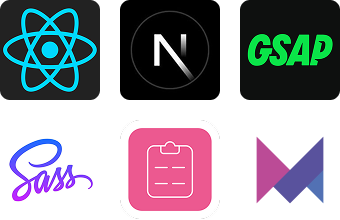
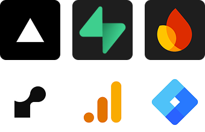

# 👋 Hello, World!  &nbsp;&nbsp;&nbsp;&nbsp;&nbsp;&nbsp;&nbsp;I'm _Gabriel Felipe_
### Full Stack Developer • Web • APIs • SSR

### 🧠 Sobre
Desenvolvo aplicações web completas em **JavaScript**, com foco em **utilidade**, **design** e **segurança**.  
Trabalho com **arquitetura E2E**, **CI/CD**, uso de **CDNs** e análise contínua de desempenho, sempre escolhendo a **stack mais adequada** para cada projeto.

### ⚙️ Tech Stack

-   &nbsp;

    

    <table width="100%">
<tr>
    <th><h3>Front End</h3></th>
    <th><h3>Back End</h3></th>
    <th><h3>Ferramentas</h3></th>
    <th><h3>Banco de Dados</h3></th>
</tr>
<tr>
    <td valign="top">
        
    </td>
    <td valign="top">
        
    </td>
    <td valign="top">
        
    </td>
    <td valign="top">
        
    </td>
</tr>
</table>

