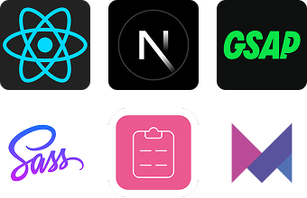
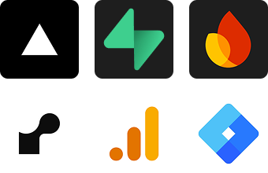

# 👋 Hello, World!  &nbsp;&nbsp;&nbsp;&nbsp;&nbsp;&nbsp;&nbsp;I'm _Gabriel Felipe_
### Full Stack Developer • Web • APIs • SSR

### 🧠 Sobre
Desenvolvo aplicações web modernas com **Next.js** e **Fastify**, equilibrando **segurança**, **utilidade** e uma experiência de usuário **(UX)** de alto nível.

Especialista em criar **interfaces fluidas** e interativas usando bibliotecas como **GSAP**, **Framer Motion**, **Lenis**, **Canvas-confetti** e outras. Meu foco é transformar ideias em produtos completos, **cuidando** de todo o **ciclo de vida do projeto** — da arquitetura do backend ao deploy automatizado com CI/CD e otimização via CDNs e análise de performance.

### ⚙️ Tech Stack

-   &nbsp;

    

    <table width="100%">
<tr>
    <th><h3>Front End</h3></th>
    <th><h3>Back End</h3></th>
    <th><h3>Ferramentas</h3></th>
    <th><h3>Banco de Dados</h3></th>
</tr>
<tr>
    <td valign="top">
        
    </td>
    <td valign="top">
        
    </td>
    <td valign="top">
        
    </td>
    <td valign="top">
        
    </td>
</tr>
</table>

### 🚀 Projetos

<table>
  <tr>
    <td width="50%" valign="top">
      <h3>🏠 Sistema Imobiliário</h3>
      
Plataforma full stack para gestão de imóveis com CRUD completo, dashboard administrativo e listagem pública para clientes. Projeto real, desenvolvido para um cliente.

      
<strong>Stack:</strong> Next.js • Fastify • PostgreSQL

      <a href="https://elsdomus.com/">🌐 Deploy</a>
    </td>
    <td width="50%" valign="top">
      <h3>🔒 Landing Page — Segurança</h3>
      
Trabalho de rebranding com criação de landing page institucional para empresa de segurança, apresentando serviços com identidade visual nova.

      
<strong>Stack:</strong> Next.js

      <a href="https://jfseguranca.com/">🌐 Deploy</a>
    </td>
  </tr>
  <tr>
    <td width="50%" valign="top">
      <h3>🎉 Site de Ano Novo</h3>
      
Site de viralização stateless e sem banco. O usuário preenche um formulário, os dados são compactados com <code>lz-string</code> e embutidos como query parameter — gerando um link único e personalizado para compartilhar.

      
<strong>Stack:</strong> React

      <a href="https://github.com/FerreiroINTZ/new_year_site">📂 Repositório</a>
    </td>
    <td width="50%" valign="top">
      <h3>💅 Click Presença</h3>
      
Plataforma SaaS para salões de beleza com dashboard, agendamento e landing pages dinâmicas por slug — cada salão escolhe um dos 5 templates, renderizado com seus dados via SSR. Autenticação via magic links.

      
<strong>Stack:</strong> Next.js • PostgreSQL • SSR dinâmico

      <a href="#">📂 Repositório (em breve)</a>
    </td>
  </tr>
  <tr>
    <td width="50%" valign="top">
      <h3>📝 Code Docs</h3>
      
Ferramenta pessoal de anotações técnicas com seções dinâmicas de texto e código. Adicione seções progressivamente com o botão <code>+</code>, alternando entre tipos conforme a necessidade.

      
<strong>Stack:</strong> Next.js • Fastify • PostgreSQL

      <a href="https://github.com/FerreiroINTZ/code-documentations/">📂 Repositório</a>
    </td>
    <td width="50%" valign="top">
      <h3>🧊 Cubo 3D — Matemática Discreta</h3>
      
Cubo interativo renderizado com React Three Fiber, com movimentação baseada em vetores e trigonometria. Une conceito matemático com implementação visual em 3D.

      
<strong>Stack:</strong> React • R3F / Three.js

      <a href="https://github.com/FerreiroINTZ/geometria-analitica-trabalho-">📂 Repositório</a>
    </td>
  </tr>
  <tr>
    <td width="50%" valign="top">
      <h3>🍪 Cookie Baker</h3>
      
Servidor que emite um cookie pro cliente — simples por dentro, mas com UI construída do zero sem nenhuma lib de animação. Prova de que UX de alto nível não depende de biblioteca.

      
<strong>Stack:</strong> React • Fastify • CSS puro

      <a href="https://github.com/FerreiroINTZ/Cookies-baker">📂 Repositório</a>
    </td>
    <td width="50%" valign="top">
      <h3>🖱️ Custom Cursor Collection</h3>
      
Três versões de cursor personalizado reunidas num super repo, cada uma com stack diferente e resultado equivalente. Comparação direta de abordagens para o mesmo problema.

      
<strong>Stack:</strong> React • Vanilla JS • GSAP

      <a href="#">📂 Repositório (em breve)</a>
    </td>
  </tr>
  <tr>
    <td width="50%" valign="top">
      <h3>💬 WhatsApp 2</h3>
      
Clone do WhatsApp usando WebSockets nativos do Fastify para comunicação em tempo real. Projeto pausado, mas demonstra domínio de mensageria bidirecional.

      
<strong>Stack:</strong> Fastify • WebSockets

      <a href="https://github.com/FerreiroINTZ/Whatsapp-2">📂 Repositório</a>
    </td>
    <td width="50%" valign="top">
      <h3>🎮 Context Word Guess</h3>
      
Jogo multiplayer por salas onde os jogadores tentam adivinhar as palavras um do outro em turnos. Estado distribuído em tempo real via WebSocket.

      
<strong>Stack:</strong> WebSockets • Sistema de salas • Lógica de turnos

      <a href="https://github.com/FerreiroINTZ/Context-Words-Guess">📂 Repositório</a>
    </td>
  </tr>
</table>
